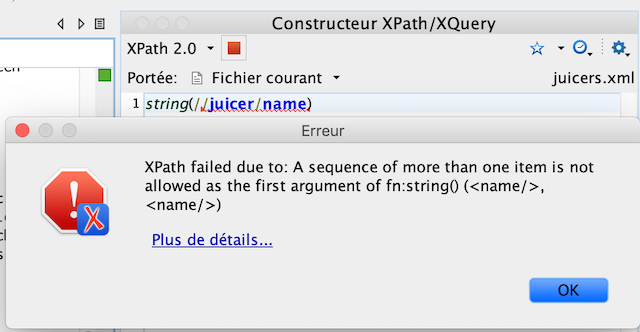

# Xpath - 2

## Les séquences

Xpath 2.0 introduit la notion de séquence à la place de `nodeset`. Une séquence se construit avec des parenthèses (objet1, objet2, …).
C'est une suite ordonnée de valeurs atomiques (string, float, integer, …) et/ou bien de nœuds.

* `('a', 'b', 'c')` : une séquence de string
* `(1, 2, 3)` : une séquence d'integer
* `(//p)` : tous les nœuds `<p>`
* `('a', 1, //p)` : un mélange
* `()`: une séquence vide
* `('')`: une séquence avec une chaîne vide

---

Le résultat d'une requête Xpath est une séquence. On voit bien sur l'image ci-dessous que la fonction `string()` qui prend en argument un seul item retourne une erreur, car le résultat de `//juicer/name` est une séquence. Il faut donc écrire `//juicer/name/string()` où la fonction `string()` sera appliquée à chaque résultat. Cependant, le résultat retourné sera toujours une séquence contenant des string.



---
Si on exécute la requête `//name/string()` le résultat sera la séquence suivante 

```
((QJ Home Juicer), (Champion Juicer), …, (Green Power Gold Juice Extractor))
```

qui sera aplatit en :

``` 
(QJ Home Juicer, Champion Juicer, …, Green Power Gold Juice Extractor).
```

Néanmoins, votre environnement d'exécution (Oxygen, BaseX, …) proposera peut-être un affichage différent, plus lisible.

Les séquences vides sont supprimées.

---
Pour mieux comprendre, tapez
`//name/string()` puis `//name/string()[1]` et `//name/count(string())`
Vous observerez que les deux premières requêtes retournent la même chose, et que la dernière affiche bien la taille de la séquence et non la taille de la string retournée.
Nous avons donc bien affaire à une séquence.


## Intéragir avec

Il est possible de

- d'extraire un objet : `('a', 'b', 'c')[2]` → `'b'`
- d'obtenir la taille : `count(('a', 'b', 'c'))` → `3`
- de faire la somme des objets la composant : `sum((1,2,3))` → `6`
- d'obtenir la moyenne avec `avg`
- d'obtenir la plus petite valeur avec `min`
- d'obtenir la plus grande valeur avec `max`

Le noeud contexte est représenté par le point `.`

- pour éliminer les chaînes vides : `('a', '', 'b', '', 'c')[.]` → `('a', 'b', 'c')`
- appliquer une fonction ou une évaluation `(1,2,3,4,5)[. > 3]` → `(4,5)`

- Créer une séquence d'entier `(x to y)`

---
### Comparaison

Il est possible de comparer avec les opérateurs. C'est à dire qu'un membre de la séquence vérifie la comparaison.

### Pour les séquences

- `<` : inférieur à
- `<=` : inférieur ou égal à
- `>` : supérieur à
- `>=` : supérieur ou égal à
- `!=` : différent de
- `=` : l'égalité avec les séquences (`1 = (1, 2)`)

### Pour les valeurs atomiques

- `eq` : l'égalité pour les valeurs atomiques (`1 eq 1`)
- `ne` : différent de
- `lt` : inférieur à
- `le` : inférieur ou égal à
- `gt` : supérieur à
- `ge` : supérieur ou égal à

---
### Exercice

En repartant du fichier `juicers.html`

1. Créer une séquence contenant les `juicer` de type centrifugeuse
2. Sélectionner la dernière machine (= dernier `juicer`) à partir de cette séquence
3. Supprimer la deuxième machine de cette séquence
4. Créer une séquence du nom des machines, la séquence doit contenir des chaînes de caractères
5. Afficher la position de la machine ayant pour nom `Juiceman Jr.`
6. Créer une séquence avec les noeuds contenant le nom des machines
7. Afficher la position du noeud contenant une balise `name` ayant pour valeur `Juiceman Jr.`
8. Créer une séquence d'entier allant de 5 à 25 (Note : ne fonctionne que pour des entiers)
9. Afficher tous les multiples de 5 de cette séquence